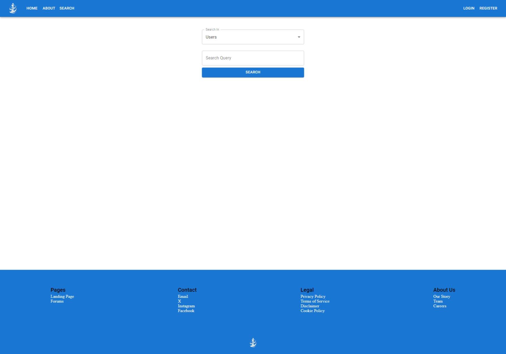
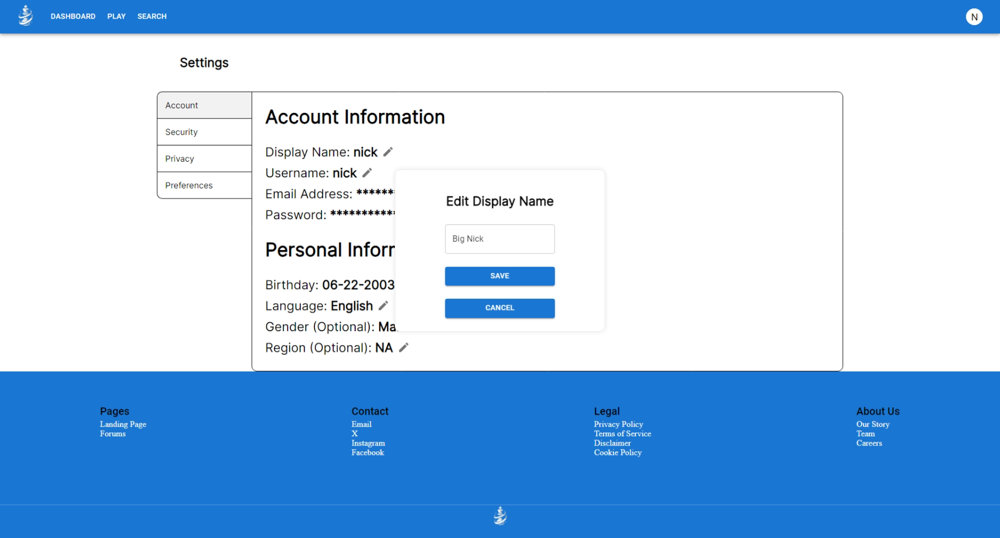
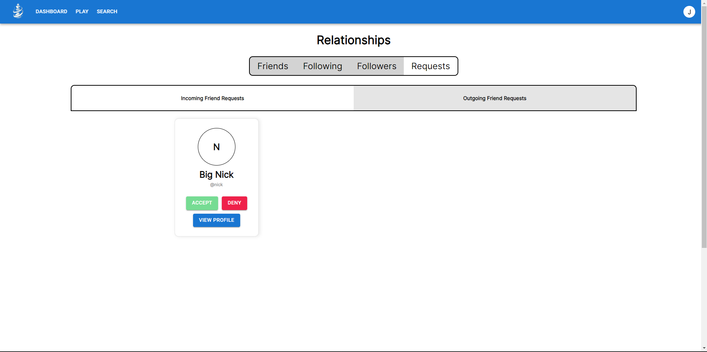
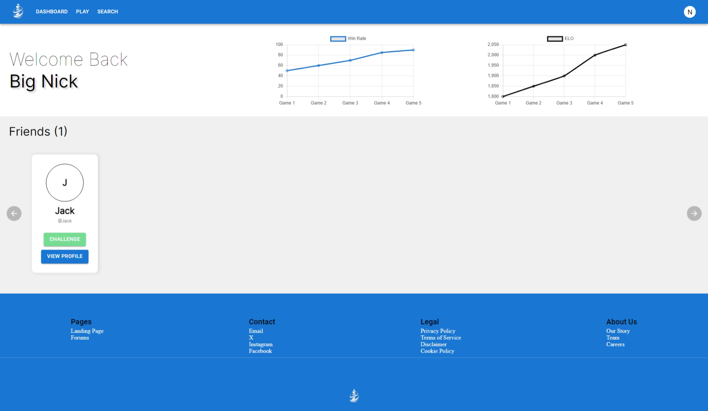
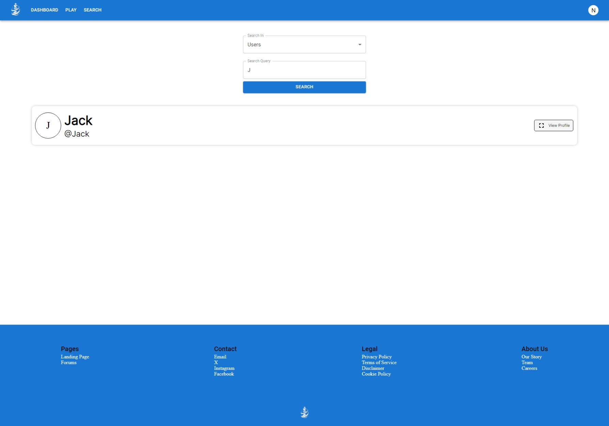
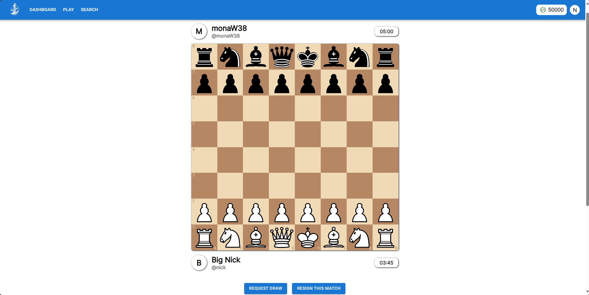
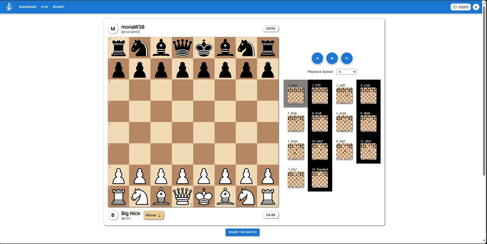

# Checkmate
Java Springboot Microservices and React Based Online Chess Matchmaking web application.

## Description
Checkmate is a dynamic online platform for chess enthusiasts. Designed with Java Spring Boot microservices and a React-based frontend, it offers a seamless experience for users to engage in chess matches, interact with other players, and climb the competitive ladder. 

# User Guide
## Getting Started
1) Select the "Register" button on the nav bar or the "Create an Account" button on the landing page.
2) Enter your desired username, email, data of birth, and password.  Then, select "Register".
3) You will be redirected to the login page.  Enter your username and password and select "Login".
4) You will be redirected to the dashboard.  From here, you can navigate to the "Search" page to find other users, the "Settings" page to change your account settings, or the "Play" page to queue for a match.

## Searching for Users
1) Select the "Search" button on the nav bar or the "Search" button on the dashboard.
2) Enter the username of the user you want to search for and select "Search".
3) You will be redirected to the search results page.  From here, you can open up the desired user's profile by selecting "View Profile".
4) On the user's profile, you can add them as a friend by selecting "Add Friend" or follow them by selecting "Follow".
5) If you have any pending friend requests, you can view them by selecting the "Friend Requests" button on the nav bar or the "Friend Requests" button on the dashboard.

## Viewing your Relationships
1) Click the profile image in the top right corner of the nav bar
2) Select the "Relationships" button
3) You will be redirected to the relationships page.  The first page you will see is the "Friends" page.  Here, you can view all of your friends and remove them by selecting "Remove Friend".
4) To view your followers, select the "Followers" button.  Here, you can view all of your followers.
5) To view the users you are following, select the "Following" button.  Here, you can view all of the users you are following.
6) To view your friend requests, select the "Friend Requests" button.  Here, you can switch between incoming and outgoing friend requests.  You can accept or decline incoming friend requests by selecting "Accept" or "Decline" respectively.  You can cancel outgoing friend requests by selecting "Cancel".

## Changing your Account Settings
1) Click the profile image in the top right corner of the nav bar
2) Select the "Settings" button
3) You will be redirected to the settings page.  Here, you can change your username, display name, and password.  To change your username, enter your desired username in the "Username" field and select "Change Username".  To change your display name, enter your desired display name in the "Display Name" field and select "Change Display Name".  To change your password, enter your current password in the "Current Password" field, your new password in the "New Password" field, and your new password again in the "Confirm New Password" field.  Then, select "Change Password".

## Playing a Match
1) Select the "Play" button on the nav bar or the "Play" button on the dashboard.
2) From here, you can just select the "Enter Queue" button to enter the queue for a match.
3) Once you are matched with an opponent, you will be redirected to the match page.  Here, you can play the match in real-time.  To move a piece, select the piece you want to move and then select the square you want to move it to.  To resign, select the "Resign" button.  To offer a draw, select the "Offer Draw" button.  To accept a draw, select the "Accept Draw" button.  To claim a draw, select the "Claim Draw" button.  To claim a win, select the "Claim Win" button.  To view the match history, select the "Match History" button.  To view the match replay, select the "Match Replay" button.  To return to the dashboard, select the "Dashboard" button.
4) If you leave the match page, you can return to it by selecting the "Play" button on the nav bar or the "Play" button on the dashboard.  You will be redirected to the match page.
5) Once a match is finished, you will be redirected to the match results page.  Here, you can view the match results and return to the dashboard by selecting the "Dashboard" button.

# Features
## User Management
- Registration: Sign up to join the community.
- Login: Access your account with secure authentication.
- Password Management: Easily change or reset your password.
## User Interactions
- Profile Customization: Update your username and display name.
- User Search: Find and connect with other players.
- Social Connections: Add friends, follow users, and manage relationships. 
## Matchmaking System
- Queue for Matches: Join a match queue and get paired with an opponent.
- Queue Management: Cancel your queue anytime before being matched.
## Live and Recorded Matches
- Play Live: Compete in real-time chess matches.
- Watch Live: Spectate ongoing games between other players.
- Match Replays: View recordings of past matches.
- Email Alerts: Set up email notifications for match updates and social interactions.
 
## Showcase











## Installation
To install Checkmate, follow these steps:
1. Ensure you have **Docker**, **Java OpenJDK 21** and **Maven** Installed on your system.
2. Open up a new terminal where you want to install the project.
3. Clone the repository using the command:
```bash
git clone https://github.com/ndon01/Checkmate.git
```
4. Navigate to the cloned directory using the command:
```bash
cd Checkmate
```
5. Now, navigate into the backend directory using the command: 
```bash
cd Backend
```
5. You can either run this command, or run #7 and #8 separately
```bash
mvn clean install
```
7. Clean the program using the following command:
```bash
mvn clean
   ```
8. Once the program is cleaned, install all dependencies the program needs with the following command:
```bash
mvn install
```
9. Now, navigate back to the root directory using the command: 
```bash
cd ..
```
10. Finally, in the main directory, run the docker compose file using:
```bash
docker-compose up --build
```
11. The program should now be running on your machine.  You can access the frontend at http://localhost:3000 and the backend at http://localhost:8080
