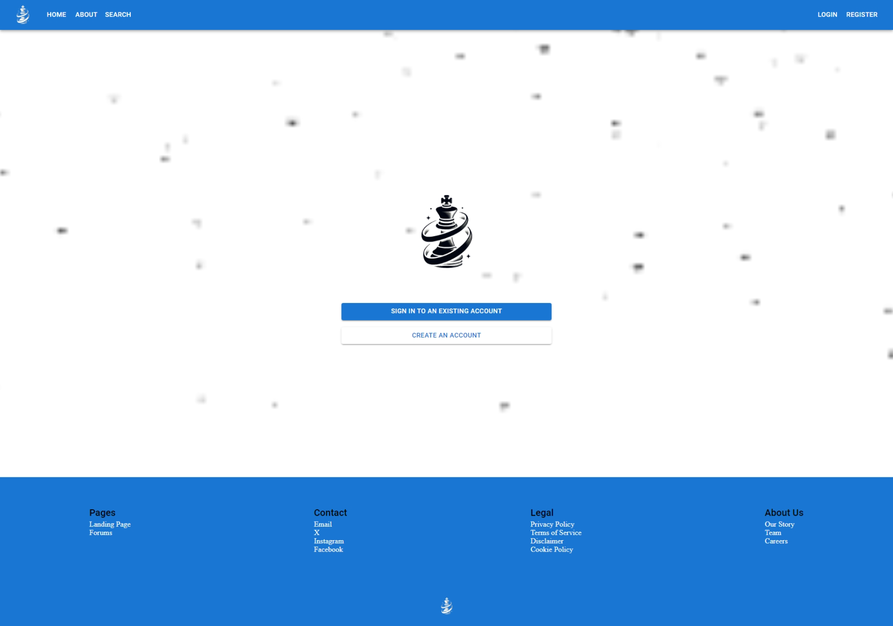
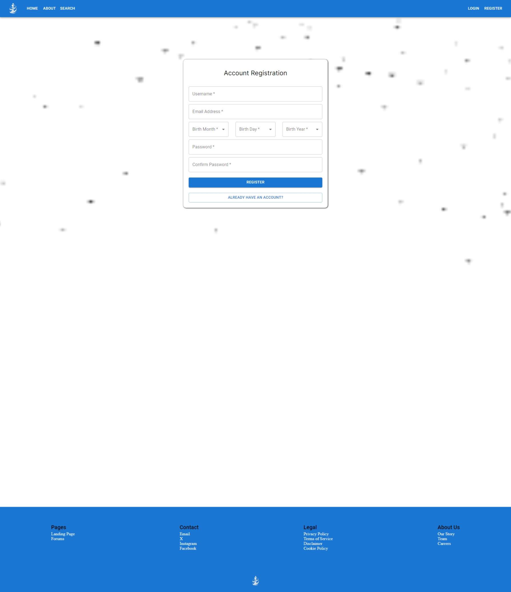
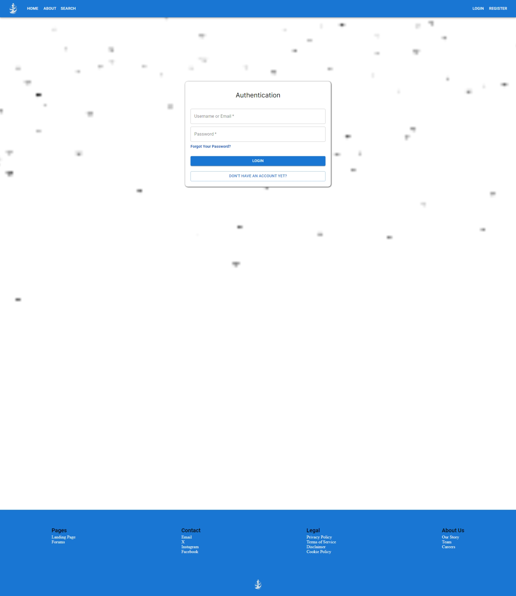

# Checkmate
Java Springboot Microservices and React Based Online Chess Matchmaking web application.

## Description
This project is a supposed to be a sit where you can meet other people, and play them in chess.  Have fun trying to rank up and ascend the ranks!

## Features
- Authentication
    - Registration
    - Login
    - Change Password
- Users
  - Change Username
  - Change Display Name
  - Search for other users
  - Add Friends
  - Follow other users
  - Manage relationship between other users
- Matchmaking
  - Currently we have one queue type implemented: 5 minute matches
  - You can queue up for a match, and you will be matched with someone else who is also queued up for a match
    - You can cancel your queue at any time, unless you are added to the match
- Matches
  - You can play a match with another user (Live)
  - You can watch a match between two other users (Live)
  - You can watch a replay of a previously played match
- Notifications
  - You can setup notifications through email
 
## Showcase

<link rel="stylesheet" type="text/css" href="//cdn.jsdelivr.net/npm/slick-carousel@1.8.1/slick/slick.css"/>


<script type="text/javascript" src="//cdn.jsdelivr.net/npm/slick-carousel@1.8.1/slick/slick.min.js"></script>


<!-- Slideshow Container -->
<div class="slideshow">
  <div></div>
  <div></div>
  <div></div>
  <!-- Add more slides as needed -->
</div>


<script type="text/javascript">
  $(document).ready(function(){
    $('.slideshow').slick({
      // Add customization options here
      dots: true,
      infinite: true,
      speed: 500,
      slidesToShow: 1,
      slidesToScroll: 1,
      autoplay: true,
      autoplaySpeed: 2000,
    });
  });
</script>


## Installation
To install Checkmate, follow these steps:
1. Ensure you have Docker, Java OpenJDK 21 and Maven Installed on your system.
2. Open up a new terminal where you want to install the project.
3. Clone the repository using the command:
```bash
git clone https://github.com/ndon01/Checkmate.git
```
4. Navigate to the cloned directory using the command:
```bash
cd Checkmate
```
5. Now, navigate into the backend directory using the command: 
```bash
cd Backend
```
5. You can either run this command, or run #7 and #8 separately
```bash
mvn clean install
```
7. Clean the program using the following command:
```bash
mvn clean
   ```
8. Once the program is cleaned, install all dependencies the program needs with the following command:
```bash
mvn install
```
9. Now, navigate back to the root directory using the command: 
```bash
cd ..
```
10. Finally, in the main directory, run the docker compose file using:
```bash
docker-compose up --build
```
11. The program should now be running on your machine.  You can access the frontend at http://localhost:3000 and the backend at http://localhost:8080
